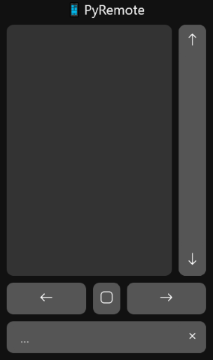
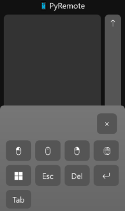

#  PyRemote

Control your computer from your phone,
or your computer from another computer,
or a device from another device.

Full keyboard and mouse support.

I made this to control my TV computer/HTPC from my phone.




## How To Use

1. Start the server on the device you'll be controlling

```bash
$ python remote.py
Server started at http://[your_ip]:8080
...
```

> Note: on Linux systems, user inputs require root permissions or a `udev` rule (see Installation below)

2. Connect to your pyremote server from another device in a web browser

3. Stop the server with `Ctrl+C`

Supported gestures include:
- Move and click the mouse
- Hold to right click
- Click and drag
- Scrolling
- Text input

This project is made for connected devices over a secured, local network
and is not intended for public networks or remote hosting.

### Quirks

Some mobile devices will capture double taps and keep the second tap from
registering as another click. If this happens, try a triple tap instead
i.e. triple tap to double click, triple tap and hold to click and drag.
If that doesn't work, then blame your phone and give up.

## How It Works

The backend is a simple `HTTPServer` python server which supports
the following request methods:

| Method   | Params                  | Description                         |
| -------- | ----------------------- | ----------------------------------- |
| GET      |                         | The remote interface page           |
| PING     |                         | Tests the connection (not ICMP)     |
| MOVE     | `x={number}&y={number}` | Moves the mouse by x and y pixels   |
| DOWN     |                         | Presses the mouse down (left click) |
| UP       |                         | Releases the pressed mouse          |
| CLICK    | `b={0\|1\|2}`           | Clicks a mouse button               |
| DBLCLICK |                         | Double-clicks the left mouse button |
| SCROLL   | `d={number}`            | Scrolls by a delta amount           |
| KEY      | `k={string}`            | Sends a keyboard key                |

These methods send OS events to mimic keyboard and mouse inputs.
Any connected device(s) can send requests.
This project includes a frontend to interpret your inputs and interface with the server.

## Installation

Tested on Python 3.10

Dependencies

```bash
$ pip install mouse keyboard
```

Clone the repo

```bash
$ git clone https://github.com/ilosey14/pyremote.git
$ cd pyremote
```

I recommend adding a shortcut to your start menu or desktop.
Set the icon from `public/favicon.ico`

### Linux

*This section details my workarounds for mouse support and user-level input access.*

#### Supporting Mouse Clicks

The `mouse` package may need to be modified to support mouse clicks.
See <a href="https://github.com/boppreh/mouse/issues/37" target="_blank">this</a> GitHub issue for more info,
which was corrected by <a href="https://github.com/boppreh/mouse/commit/9c5630f0d9d6f4f76cf56291ce3f864e87ad1105" target="_blank">this</a> commit.

However, until the pip package is updated, the easiest fix is to copy over the updated source.
The file will be located at `/usr/lib/python3.X/site-packages/mouse/_nixcommon.py` or similar.
The updated source can be found <a href="https://raw.githubusercontent.com/boppreh/mouse/9c5630f0d9d6f4f76cf56291ce3f864e87ad1105/mouse/_nixcommon.py" target="_blank">here</a>.

If the up-to-date source does not work, you may instead revert the `_nixcommon.py` file back to its original form and explicitly add your desired event codes.
The complete list is defined in `/usr/include/linux/input-event-codes.h`.
For example:

```diff
/usr/lib/python3.X/site-packages/mouse/_nixcommon.py
@@ -32,2 +32,5 @@
---
* [32][32]     for i in range(256):
* [33][33]         fcntl.ioctl(uinput, UI_SET_KEYBIT, i)
+     [34]     fcntl.ioctl(uinput, UI_SET_KEYBIT, 0X110) # BTN_LEFT
+     [35]     fcntl.ioctl(uinput, UI_SET_KEYBIT, 0X111) # BTN_RIGHT
+     [36]     fcntl.ioctl(uinput, UI_SET_KEYBIT, 0X112) # BTN_MIDDLE
```

#### Permissions

You can permit user access to the `uinput` kernel module without elevation (sudo, su, doas, etc.)
by adding a new `udev` rule.

```rules
/etc/udev/rules.d/50-uinput.rules
---
KERNEL="uinput", TAG+="uaccess"
```

The `mouse` and `keyboard` packages look for an elevated run-level rather than `uinput` access.
Force these checks to pass by further editing the `_nixcommon.py` files:

```python
# /usr/lib/python3.X/site-packages/{mouse,keyboard}/_nixcommon.py
...
def ensure_root():
    return True
    # comment original code
```

Discussions on user access to `uinput`:
- [Stack Overflow](https://stackoverflow.com/questions/11939255/writing-to-dev-uinput-on-ubuntu-12-04)
- [Steam Forums](https://steamcommunity.com/app/353370/discussions/2/1735465524711324558/)

Further info on `udev` rules:
- [Arch Wiki](https://wiki.archlinux.org/title/Udev)

## TODO

- [ ] Add user settings to menu
  - Double click delay
  - Right click hold duration
  - Touch/scroll sensitivity
  - Invert scrolling
  - Swap scrollbar side
  - Custom key combinations
  - Change ui colors

## Attribution

"Python" is a registered trademark of the PSF.
The Python logos (in several variants) are use trademarks of the PSF as well.
<br>
https://www.python.org/psf/trademarks/

mouse
<br>
https://pypi.org/project/mouse/

keyboard
<br>
https://pypi.org/project/keyboard/

Icons are from the Bootstrap Icons pack.
Icons and documentation licensed under [MIT](https://github.com/twbs/icons/blob/main/LICENSE.md).
<br>
https://icons.getbootstrap.com/