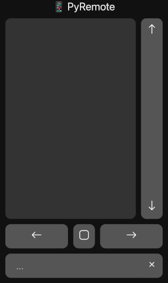
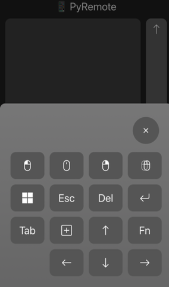

#  PyRemote

Control your computer from your phone,
or your computer from another computer,
or a device from another device.

Full keyboard and mouse support.

I made this to control my TV computer/HTPC from my phone.




## How To Use

1. Start the server on the device you'll be controlling

```bash
$ python remote.py
Server started at http://[your_ip]:8080
...
```

2. Connect to your pyremote server from another device in a web browser

3. Stop the server with `Ctrl+C`

Supported gestures include:
- Move and click the mouse
- Hold to right click
- Click and drag
- Scrolling
- Text input

This project is made for connected devices over a secured, local network
and is not intended for public networks or remote hosting.

### Quirks

Some mobile devices will capture double taps and keep the second tap from
registering as another click. If this happens, try a triple tap instead
i.e. triple tap to double click, triple tap and hold to click and drag.
If that doesn't work, then blame your phone and give up.

## How It Works

The backend is a simple `HTTPServer` python server which supports
the following request methods:

| Method   | Params                  | Description                         |
| -------- | ----------------------- | ----------------------------------- |
| GET      |                         | The remote interface page           |
| MOVE     | `x={number}&y={number}` | Moves the mouse by x and y pixels   |
| DOWN     |                         | Presses the mouse down (left click) |
| UP       |                         | Releases the pressed mouse          |
| CLICK    | `b={0\|1\|2}`           | Clicks a mouse button               |
| DBLCLICK |                         | Double-clicks the left mouse button |
| SCROLL   | `d={number}`            | Scrolls by a delta amount           |
| KEY      | `k={string}`            | Sends a keyboard key                |

These methods send OS events to mimic keyboard and mouse inputs.
Any connected device(s) can send requests.
This project includes a frontend to interpret your inputs and interface with the server.

## Installation

Tested on Python 3.10

Dependencies

```bash
$ pip install mouse keyboard
```

Clone the repo

```bash
$ git clone https://github.com/ilosey14/pyremote.git
$ cd pyremote
```

I recommend adding a shortcut to your start menu or desktop.
Set the icon from `public/favicon.ico`

## TODO

- [ ] Check for connection
  - `request('PING').then([onsuccess], [onfailure]);`
  - Show banner overlay with [try again] button
    - Do the same on any failed request
- [ ] Add user settings to menu
  - Double click delay
  - Right click hold duration
  - Touch/scroll sensitivity
  - Invert scrolling
  - Swap scrollbar side
  - Custom key combinations
  - Change ui colors

## Attribution

"Python" is a registered trademark of the PSF.
The Python logos (in several variants) are use trademarks of the PSF as well.
<br>
https://www.python.org/psf/trademarks/

mouse
<br>
https://pypi.org/project/mouse/

keyboard
<br>
https://pypi.org/project/keyboard/

Icons are from the Bootstrap Icons pack.
Icons and documentation licensed under [MIT](https://github.com/twbs/icons/blob/main/LICENSE.md).
<br>
https://icons.getbootstrap.com/